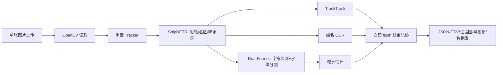
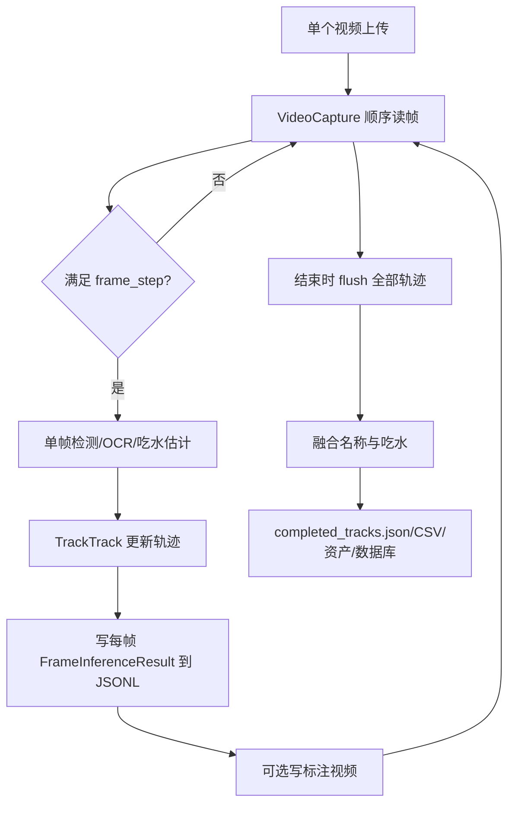
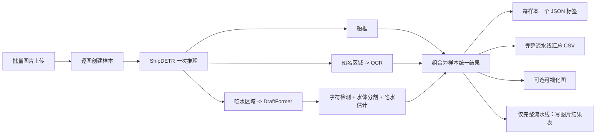
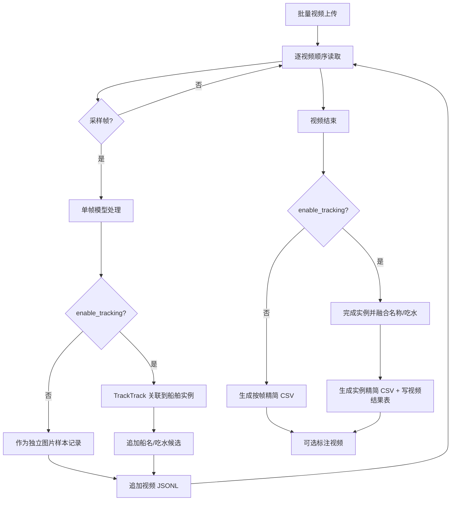
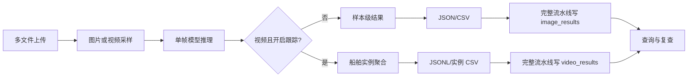

# VesselSight 后端简化改进方案

> 本文是重构目标方案，不要求兼容当前旧接口、旧表或旧结果目录。
> 设计原则：**以结果正确、结构干净、文件少、表少、调用短为优先级；不为未来假设增加层级。**

## 1. 最终决策

本次改造采用以下边界：

1. 图片是独立样本，直接进行单帧推理；默认**不经过目标跟踪**。
2. 视频仍由单帧模型处理；`enable_tracking=false` 时，每个采样帧按图片处理；`enable_tracking=true` 时，再将同一轨迹的帧级结果汇总为一个船舶实例。
3. 单独任务只生成结果文件，不写业务数据库。
4. 完整流水线才写数据库；数据库只保留两张结果表：图片型结果表、跟踪视频实例表。
5. 每个图片样本一个统一 JSON 标签文件；水体分割也写进该 JSON，不再将 PNG mask 作为唯一标签格式。
6. 每个视频只保留一个详细 JSONL 和一个面向日常查看的精简 CSV；可视化默认关闭。
7. 直接重构为新实现，不写旧 API、旧表、旧目录、旧 JSON 格式的兼容分支。历史数据如需保留，整体归档到 `archive/`，不进入新代码调用链。

## 2. 数据单位：只区分样本和船舶实例

为保证简洁，只使用以下业务概念：

| 名称 | 含义 |
|---|---|
| 任务 | 一次上传请求，可包含多个图片或视频文件 |
| 样本 | 一张图片，或视频中一个被采样处理的帧 |
| 帧结果 | 一个样本内某艘船的单帧检测、船名、吃水结果 |
| 船舶实例 | 开启跟踪时，视频中同一 `track_id` 对应的一艘连续出现的船 |

一张图片或一个视频帧可能有多艘船。因此“一个样本一条数据”应理解为：一个样本有一个 JSON 标签文件；其中可包含多个船舶目标。数据库中，图片型表可因一图多船而有多行同名 `filename`，以主键区分即可，不强行建立“图片文件 = 一条船记录”的错误关系。

## 3. 当前流程与问题

### 3.1 当前图片流程



优点：模型链路完整；检测模型只执行一次；已有 OCR、吃水估计和可视化输出。

问题：图片没有跨帧语义，却创建、更新、再立即结束 Tracker；图片流程被视频轨迹概念污染，增加理解和维护成本。图片应直接输出单帧结果。

### 3.2 当前视频流程



优点：有逐帧 JSONL；轨迹完成才保存证据；已有船名投票和吃水离群值剔除。

问题：任务输出目录层级偏多；视频 CSV 字段过多；数据库混合了业务摘要、绝对文件路径和整段 JSON；`tracking` 任务在部分调度代码中实际走完整流水线，任务语义不清；只支持单文件上传。

## 4. 简化后的图片流程

### 4.1 图片处理流程



### 4.2 图片任务及输出

| 任务 | 输出 | 是否写数据库 |
|---|---|---|
| 船/船名区域/吃水区域检测 | 每样本一个统一 JSON；可选可视化图 | 否 |
| 船名识别 | 一个 CSV：`filename,recognized_zh,recognized_en`；可选可视化图 | 否 |
| 船舶吃水读数估计 | 每样本一个统一 JSON；一个 CSV：`filename,draft_depth_m`；可选可视化图 | 否 |
| 图片完整流水线 | 每样本一个统一 JSON；**一个**汇总 CSV；可选可视化图 | 是 |

图片完整流水线唯一 CSV：

```csv
filename,recognized_zh,recognized_en,draft_depth_m
pl_813.jpg,贵港海泰52,GUIGANGHAITAI52,4.2166
```

一图多船时允许同一个 `filename` 有多行，行的顺序与 JSON 内船对象顺序一致。不要为此增加暴露给客户的冗余字段；需要精确定位时直接查看该图片对应 JSON。

### 4.3 统一 JSON 标签格式

所有涉及几何检测或分割的图片样本均使用一个统一 JSON 文件。该格式以 LabelMe 的基本结构为基础，船框、区域框和吃水字符使用矩形；水体分割使用 `water` 多边形。这样水体分割标签和检测标签都是 JSON，不再依赖单独 PNG 作为标签结果。

```json
{
  "version": "2.0",
  "imagePath": "pl_813.jpg",
  "imageWidth": 4608,
  "imageHeight": 2592,
  "shapes": [
    {
      "label": "ship",
      "shape_type": "rectangle",
      "points": [[293.0, 351.0], [4603.9, 1723.1]],
      "confidence": 0.9222
    },
    {
      "label": "ship_name_area",
      "shape_type": "rectangle",
      "points": [[1351.9, 1203.5], [1947.5, 1380.7]],
      "confidence": 0.8622
    },
    {
      "label": "draft_mark:6",
      "shape_type": "rectangle",
      "points": [[1560.3, 1509.9], [1579.4, 1537.7]],
      "confidence": 0.9856
    },
    {
      "label": "water",
      "shape_type": "polygon",
      "points": [[1492, 1608], [1653, 1608], [1653, 1650], [1492, 1650]],
      "confidence": 1.0
    }
  ],
  "results": {
    "recognized_zh": "贵港海泰52",
    "recognized_en": "GUIGANGHAITAI52",
    "draft_depth_m": 4.2166,
    "draft_success": true,
    "draft_method": "GridV4"
  }
}
```

实现方式：DraftFormer 得到二值 mask 后，用轮廓提取生成 `water` polygon；可设置最小面积过滤小噪点、Douglas-Peucker 简化轮廓。若后续确实需要像素级无损复算，可把压缩 RLE 作为 JSON 中的可选 `water_rle` 字段；对外的统一标签文件仍然是这一个 JSON。

## 5. 简化后的视频流程

### 5.1 总流程



### 5.2 未开启跟踪

未开启跟踪时，不创建船舶实例。每个采样帧等价于一张图片，视频中的完整流水线结果按**图片类型**写入图片结果表。

- 每视频一个 `<视频名>.jsonl`，每行一个采样帧的详细结果；
- 每视频一个 `<视频名>.csv`，每行一艘船，仅保留：`frame_index,recognized_zh,recognized_en,draft_depth_m`；
- 可选一个 `<视频名>_annotated.mp4`，默认关闭；
- 不输出额外的逐帧 LabelMe 文件，详细帧信息统一放 JSONL，避免产生海量小文件。

### 5.3 开启跟踪

开启跟踪时，帧级模型输出不变，但通过 `track_id` 聚合。最终一艘船舶实例只产生一行给客户/日常查看的 CSV；所有详细帧信息只保存到同一个视频 JSONL。

精简 CSV：

```csv
instance_id,recognized_zh,recognized_en,draft_depth_m,start_time,end_time,status
1,贵港海泰52,GUIGANGHAITAI52,4.2166,2026-08-08T10:00:01Z,2026-08-08T10:00:18Z,confirmed
```

字段说明：

- `instance_id`：该视频内的 Track ID；
- 船名与吃水：最终融合值；
- `start_time/end_time`：实例出现区间，便于用户在原视频定位；
- `status`：`confirmed` 或 `pending_review`。

不在 CSV 中放置信度、帧数、路径、模型版本、bbox、原始候选等信息；这些只存在 JSONL 中，供复查使用。

### 5.4 每视频一个 JSONL

JSONL 是唯一的详细复查文件。使用两种记录类型，既能逐帧回放，也能在最后直接看到实例汇总；不要再输出 `completed_tracks.json`、多个阶段 JSON、多个 CSV。

```jsonl
{"type":"frame","frame_index":15,"time":"2026-08-08T10:00:03Z","vessels":[{"track_id":1,"ship_box":[293,351,4311,1372],"ship_confidence":0.9222,"recognized_zh":"贵港海泰52","ocr_confidence":0.8622,"draft_depth_m":4.2166,"draft_confidence":0.810,"labels":[...]}]}
{"type":"instance","instance_id":1,"start_time":"2026-08-08T10:00:01Z","end_time":"2026-08-08T10:00:18Z","recognized_zh":"贵港海泰52","recognized_en":"GUIGANGHAITAI52","draft_depth_m":4.2166,"status":"confirmed","name_candidates":[...],"draft_statistics":{"count":8,"rejected_count":1,"std":0.06}}
```

JSONL 中帧记录包含 bbox、字符框、水体 polygon、置信度和单帧候选；实例记录包含融合过程所需的候选和统计。日常用户只看 CSV，不会被这些细节分散注意力。

## 6. 船舶实例的简单高效融合策略

你的判断正确：视频的重点是按船舶实例记录，不是改变模型输入。推荐保留当前“轻量累计、结束时融合”的思路，不缓存所有原始图像，只保存每帧数值和必要的详细 JSONL。

### 6.1 跟踪生命周期

1. 首次检测到船：新建 `track_id`，状态 `tentative`。
2. 达到 `confirm_hits`（建议默认 3）后：状态 `confirmed`。
3. 连续缺失超过 `lost_seconds`（建议默认 2 秒）：状态 `lost`。
4. 缺失超过 `finish_seconds`（建议默认 8 秒）或视频结束：结束实例，执行最终融合。
5. `track_id` 只在一个视频内唯一；数据库查询时由视频记录 ID + `track_id` 定位。

### 6.2 船名融合

删除 `image_quality`。当前清晰度/曝光/面积的组合分数没有经过业务标定，加入权重反而会使结果不可解释。船名聚合只使用模型已经给出的两个直接证据：船名区域检测置信度 `name_roi_confidence` 与 OCR 置信度 `ocr_confidence`。

同一实例中，**完全相同的船名文本（逐个中文字符、英文字符和数字均相同）视为一种候选结果**。候选出现的帧数天然会增加其总分，因此“多帧反复得到相同文本”会被正确地视为更可信；但高低置信度仍会影响每次出现的贡献。

#### 每帧候选

对当前实例的第 `i` 个有效 OCR 结果，先计算：

```text
name_key_i = normalize(ocr_text_i)
weight_i   = name_roi_confidence_i × ocr_confidence_i
```

- `normalize`：Unicode 规范化、去空白、英文转大写，保留中文/字母/数字；
- OCR 为空、`name_key` 为空的帧直接忽略；
- 不设置未经标定的 OCR 硬阈值。OCR 置信度若后续验证存在整体偏低/偏高，可只在一个 `calibrate_ocr_confidence()` 函数中校准，聚合规则不变；
- 原始文本、两个置信度、`name_key` 和 `weight` 都写入视频 JSONL 的帧记录。

#### 当前船名：从被赋予 ID 到当前帧

设该实例从首次出现到当前帧 `t` 的候选集合为 `H_t`。对每一种候选名称 `k`：

```text
score_t(k) = Σ(weight_i),  i ∈ H_t 且 name_key_i = k
count_t(k) = 该候选出现的有效帧数
```

当前船名为 `score_t(k)` 最大的候选；如总分相同，依次按出现次数更多、最近一次出现时间更晚、字典序排序，保证确定性。当前名称可信占比为：

```text
current_name_share = score_t(best) / Σ(score_t(all candidates))
```

当前名称在每一个处理帧后更新，用于实时页面显示。若还没有有效 OCR，显示 `UNKNOWN`、状态为 `pending_review`。

#### 最终船名：实例结束时

当船舶实例因视频结束或 `finish_seconds` 超时而结束时，使用**该实例全部历史帧**按相同公式再计算一次。最终船名就是最后一帧的当前船名计算结果；区别仅在于历史集合已封闭，不会再变化。

名称状态规则：最佳候选至少出现 2 次、`current_name_share >= 0.70`、与第二名的分数占比差至少 `0.15` 时为 `confirmed`，否则为 `pending_review`。最终名称的中文字段为赢家原始文本的规范化显示值；英文字段由该值生成大写拼音，数字保持不变。

### 6.3 吃水融合

吃水的“当前值”和“最终值”也使用同一个稳健函数，唯一差异是输入帧范围：当前值使用起始帧到当前帧，最终值使用已结束实例的全部帧。

#### 每帧候选

第 `i` 帧只有在以下条件都满足时才提供吃水候选：

1. DraftFormer/结构约束算法返回 `success=true`；
2. `draft_depth_m` 在配置的物理范围内（初始建议 `0.1m ~ 5m`，按现场船型再调整）；
3. 吃水区域检测存在。

候选权重只使用模型直接输出：

```text
weight_i = waterline_roi_confidence_i × mean(draft_character_confidences_i)
```

若该帧没有有效字符检测，则该帧不参与吃水融合。水体分割当前没有独立置信度，不人为构造“图像质量”分数。

#### 当前吃水：从被赋予 ID 到当前帧

设截至当前帧的有效吃水候选为 `(depth_i, weight_i)`：

1. 没有候选时，当前吃水为 `null`；
2. 候选少于 3 条时，取加权中位数，不做离群值剔除；
3. 候选达到 3 条后，先取数值中位数 `m` 和 `MAD = median(|depth_i - m|)`；
4. 剔除满足 `|depth_i - m| > max(0.10m, 3 × MAD)` 的候选；
5. 对保留候选取加权中位数，得到当前吃水值；
6. 每帧更新当前值、有效数、剔除数和标准差，供实时页面显示及写入 JSONL。

#### 最终吃水：实例结束时

实例结束时，对该实例的全部候选按上述相同步骤重算，得到最终吃水。这意味着最终值可能与最后一个实时当前值相同，也可能因结束前最后一帧的新候选触发离群值重新判定而有小幅变化。

吃水状态规则：保留候选至少 5 条且标准差 `<= 0.15m` 时为 `confirmed`，否则为 `pending_review`。实例总体 `status` 仅在船名和吃水均为 `confirmed` 时才为 `confirmed`；任一属性待复核，则实例总体为 `pending_review`。

计算仅维护每帧一个数值、一个权重和少量统计量，复杂度与有效候选数线性相关，适合长视频。

## 7. 极简文件目录与命名

不再按任务、阶段、输入、输出多层嵌套。每个任务只有一个平坦结果目录：

```text
data/results/<task-id>/
  job.json                       # 状态、参数、文件列表
  result.csv                     # 该任务面对用户的汇总结果
  <source-stem>.json             # 图片：一个样本一个统一标签 JSON
  <source-stem>.jsonl            # 视频：一个视频一个详细 JSONL
  <source-stem>_vis.jpg          # 可选图片可视化
  <source-stem>_annotated.mp4    # 可选视频可视化
```

批量上传时，若文件同名，则使用上传顺序前缀避免冲突：`001_<source-stem>.json`、`002_<source-stem>.jsonl`。不再创建 `upload/`、`output/`、`labels/`、`tables/`、`assets/`、`visualizations/` 等多级目录。

原始上传文件可保存于 `data/uploads/<task-id>/`，完成后不需要在结果目录复制一份。是否长期保留原文件只由一个 `RETENTION_DAYS` 清理任务控制。

## 8. 极简数据库与 AIS 关联

数据库仅保留六张业务表：`offline_image_result`、`offline_video_result`、`realtime_video_results`、`realtime_tracking_results`、`realtime_AIS` 和 `ship_archive`。任务过程数据仍写入结果目录的 `job.json` 与 JSONL。

### 8.1 离线视觉结果

- `offline_image_result`：图片和未启用跟踪的视频帧结果，一条船舶检测结果一行。
- `offline_video_result`：离线视频跟踪结果，一条船舶实例一行，约束为 `UNIQUE(video_filename, instance_id)`。
- `realtime_video_results`：实时监测逐帧结果；一帧一行，全部检测目标保存在 `payload_json`。
- `realtime_tracking_results`：实时监测跟踪结果；一条船舶实例一行，约束为 `UNIQUE(session_id, instance_id)`，也是实时仪表盘统计的唯一数据源。

两个实例级结果表 `offline_video_result` 和 `realtime_tracking_results` 共同保存：

```text
recognized_zh, recognized_en, draft_depth_m, status, ais_mmsi,
to_bow, to_stern, to_port, to_starboard, AIS_draught, Displacement
```

其中 `draft_depth_m` 是视觉测量吃水；`AIS_draught` 是关联 AIS（实时 AIS 缺失时可由档案回退）的吃水；二者绝不互相覆盖。`Displacement` 为估算排水量，按内河船默认方形系数 `Cb = 0.75` 计算：

```text
Displacement = (to_bow + to_stern) × (to_port + to_starboard) × draft_depth_m × 0.75
```

任一几何值或视觉吃水缺失时，`Displacement` 为 `NULL`，不以 0 代替。

### 8.2 实时 AIS 表：`realtime_AIS`

该表记录近期接收到并解析后的 AIS 消息，按 `BaseDateTime` 清理旧数据。标准字段为：

```text
MMSI, BaseDateTime, LAT, LON, SOG, COG, Heading,
VesselName, IMO, CallSign, VesselType, Status,
Length, Width, Draft, Cargo, TransceiverClass
```

为支持船体几何融合，表还保存 AIS 静态消息解析出的 `to_bow`、`to_stern`、`to_port`、`to_starboard`。索引为 `(MMSI, BaseDateTime)`、`BaseDateTime` 与 `(VesselName, BaseDateTime)`。

### 8.3 长期船舶档案：`ship_archive`

该表由 [Master_Ship_Archive_Database.csv](assets/Master_Ship_Archive_Database.csv) 导入，当前有 **46,799** 条 MMSI 唯一记录。业务字段与 CSV 完全对应：

```text
mmsi, imo, callsign, shipname, ship_type,
to_bow, to_stern, to_port, to_starboard, draught,
record_count, static_record_count, filled_static_fields
```

空值保持为 `NULL`；`mmsi` 唯一，`shipname` 建索引用于精确回退匹配。档案表只提供长期静态信息，不直接作为实时监测统计来源。

### 8.4 视觉船名与 AIS/档案关联

仅对启用跟踪的实例结果执行关联，即写入 `offline_video_result` 与 `realtime_tracking_results` 时执行。匹配条件是视觉识别船名与 `realtime_AIS.VesselName` 或 `ship_archive.shipname` **完全相同**；不做大小写、空格、标点归一化，也不做模糊匹配。

关联与填充顺序：

1. 以视觉船名查询 `realtime_AIS.VesselName`，按 `BaseDateTime` 倒序排列；
2. 从最新消息开始逐条填充 `to_bow`、`to_stern`、`to_port`、`to_starboard`、`Draft → AIS_draught`，直到五项齐全或无更多记录；
3. 只有实时 AIS 完全没有同名记录时，才从 `ship_archive.shipname` 精确查询，并选择静态字段完整度最高的记录作为回退；
4. 将解析出的 MMSI、几何信息和 `AIS_draught` 写入实例结果；用视觉 `draft_depth_m` 计算并写入 `Displacement`。

这保证 AIS 的多条实时消息可互补几何信息，同时避免把档案数据覆盖已有实时 AIS 信息。

### 8.5 实时监测仪表盘

仪表盘只聚合中国时区当天 `start_time` 落入当天的 `realtime_tracking_results`。船舶实例首次出现即创建记录，活动期间持续更新，因此统计无需等待实例结束：

- 今日已归档船舶：当天开始的船舶实例数；
- 平均视觉吃水：当天非空 `draft_depth_m` 的均值；
- 平均估算排水量：当天非空 `Displacement` 的均值；
- 超载预警：当天 `draft_depth_m > 4.6m` 的实例数；
- 24 小时趋势：最近 24 个整点的实例流量和平均视觉吃水，零流量小时也返回。

## 9. 批量上传接口

将当前单文件接口直接改为批量文件接口，不保留旧的单文件分支。单文件上传自然是 `files` 只有一个元素的特例。

```http
POST /api/jobs
Content-Type: multipart/form-data

files: <file-1>
files: <file-2>
task: full_pipeline
enable_tracking: true
frame_step: 5
visualize: false
camera_id: offline-01
```

返回：

```json
{
  "task_id": "20260808-abc123",
  "status": "queued",
  "files": [
    {"filename": "a.jpg", "status": "queued"},
    {"filename": "b.mp4", "status": "queued"}
  ]
}
```

规则：

- 一个任务可同时含图片和视频，按上传顺序串行使用 GPU；
- `enable_tracking` 仅对视频有效；图片忽略该值；
- `visualize=false` 为默认值；
- 单独任务不写两张结果表；完整流水线才写；
- `GET /api/jobs/{task_id}` 只返回 `job.json` 的状态和结果文件相对 URL，不把 JSONL 内容塞进 HTTP 响应。

## 10. 后端代码整理：少文件、短调用链

不要引入过多的 `domain/application/infrastructure/repository` 分层。建议保留少量职责明确的核心文件；模型 ONNX 后端可继续单独存在。

```text
backend/app/
  main.py            # FastAPI 创建、路由注册、启动/停止
  api.py             # /api/jobs、查询、下载、实时入口
  schemas.py         # 请求、响应、JSON/JSONL 数据模型
  jobs.py            # 任务队列、批量上传、job.json 状态
  pipeline.py        # 图片/视频循环、任务分支、完整流水线
  tracking.py        # TrackTrack、实例状态、船名和吃水融合
  storage.py         # JSON/JSONL/CSV/可视化写入、相对路径
  models.py          # 两张视觉结果表 + ais_live + ship_archive
  database.py        # SQLAlchemy engine、session、视觉结果/AIS 的简单读写函数
  inference/
    onnx_backends.py
    model_registry.py
    frame_inference.py  # 输入一张 ndarray，返回一张图的结构化结果
```

调用路径固定为：

```text
api.py -> jobs.py -> pipeline.py -> frame_inference.py
                              -> tracking.py（仅跟踪视频）
                              -> storage.py
                              -> database.py（仅完整流水线）
```

约束：

- `frame_inference.py` 只处理一张图，不读视频、不写文件、不写数据库；
- `pipeline.py` 是唯一的视频读取和任务编排位置；
- `tracking.py` 只负责轨迹关联和最终融合；
- `storage.py` 是唯一直接写 JSON、JSONL、CSV、图片、视频的位置；
- `database.py` 只写/读 `image_results`、`video_results`、`ais_live`、`ship_archive`，不承担任务调度或文件写入；
- 不保留当前的 `OfflineInferenceRunner` / `StandaloneTaskRunner` 双实现，不保留“任务名称进入同一分支后隐式变成另一任务”的逻辑。

## 11. 直接重构步骤

1. 建立新的 `frame_inference.py`：从当前 Worker 提取 ShipDETR、OCR、DraftFormer、吃水估计的单图逻辑；删除单图 Tracker 调用。
2. 建立新的 `tracking.py`：从当前 Worker 提取 TrackSnapshot、船名融合、吃水融合；只供视频跟踪调用。
3. 重写 `pipeline.py`：统一批量图片、视频无跟踪、视频跟踪三种循环；仅这一个文件决定输出类型。
4. 重写 `storage.py`：统一生成图片 JSON、视频 JSONL、CSV；所有路径均为相对路径。
5. 删除当前旧 Job/输出/持久化链路，创建 `image_results`、`video_results`、`ais_live`、`ship_archive` 四表；视觉结果表保持只有两张。
6. 重写 API 为批量上传接口并同步调整前端；旧接口和旧表不做兼容。
7. 将旧结果目录和旧 SQLite 数据库移至 `archive/`，新系统从空库开始；若业务需要历史查询，另写一次性导入脚本，脚本不进入运行时。

## 12. 必测场景

- 单张图片：生成一个 JSON、一个汇总 CSV 行，模型不创建 Tracker；
- 一张图片多船：一个 JSON 含多个 `ship`，CSV/图片结果表有多行同名 filename；
- 单独船名任务：仅 CSV 和可选图；
- 单独吃水任务：统一 JSON 内含字符框和 `water` polygon，CSV 含读数；
- 视频无跟踪：一个 JSONL、一个按帧 CSV，写 `image_results`；
- 视频跟踪：一个 JSONL、一个按实例 CSV，只写 `video_results`；
- AIS 档案 CSV 导入：46,799 条 MMSI 可写入 `ship_archive`，空字段写为 `NULL`；重复船名不自动造成视觉关联；
- AIS 实时消息：写 `ais_live` 后可按 MMSI 查询最新消息，不影响视觉结果入库；
- 低置信 OCR、异常吃水、无船帧：正确写入 `pending_review` 或空值，不产生崩溃；
- 多文件任务：一个文件失败不影响其他文件继续处理；
- 所有结果路径为相对 URI，不出现本机绝对路径；
- `visualize=false` 时不产生 JPG/MP4。

## 13. 最终闭环



该方案保留模型、跟踪和融合的必要复杂度，删除不必要的目录嵌套、表、层级、兼容代码和重复输出：客户看一份精简 CSV，需要复查时只打开对应的 JSON 或 JSONL。
